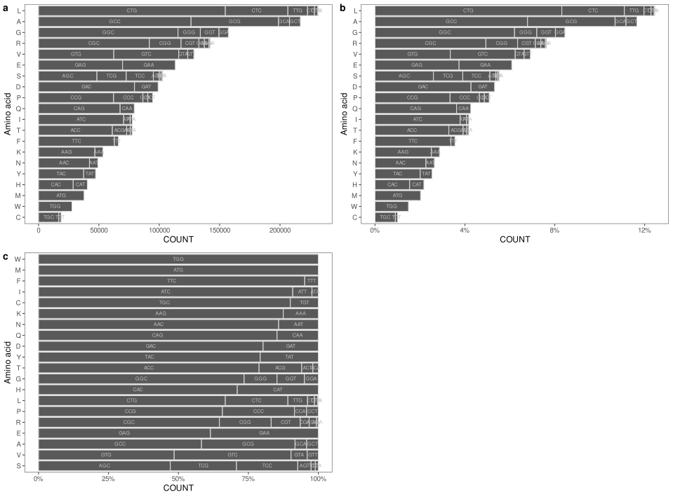

# cub 

<!-- badges: start -->
[](https://lifecycle.r-lib.org/articles/stages.html#experimental)
<!-- badges: end -->

The **Cub** package provides tools for whole-genome codon usage bias analysis.

## Installation

You can install the development version of cub from [GitHub](https://github.com/) with:

``` r
# install.packages("devtools")
devtools::install_github("utubun/cub")
```

## Examples

In this section you can find examples of package usage

### Create a `Cub` object from `DNAString`

The package contains CDSs extracted from PAO1 and PA14 genomes. You can use any of these datasets as shown below:

``` r
library(cub)
pao1cds <- PAO1CDS
pa14cds <- PA14CDS
```

Next, we will construct a `Cub` instances from this datasets:

``` r
pao1 <- Cub(pao1cds)
pa14 <- Cub(pa14cds)
```

The package provides you with the set of functions designed to work on these objects.

### Import `Cub` objects directly from the package data

Both `Cub`s for PAO1 and PA14 are directly available in the package, you can import them as shown below:

``` r
pao1 <- PAO1
pa14 <- PA14
```

### Visualizing data

Currently you can plot codon counts, *Relative Synonymous Codon Usage* indices (1), *Relative Codon Adaptation* indices (1), and *Codon Adaptation Indices* (1) absolute or scaled for all genome, or by individual amino acid.

``` r
plot(pao1, value = 'count', scale = FALSE)
plot(pao1, value = 'count', scale = TRUE)
plot(pao1, value = 'count', scale = 'aa')
```



### Data export

Follow the usual R pattern for saving the data. For example, to save codon counts absolute, or scaled by amino acid, do the following:

``` r
count(pao1) |>
  as.data.frame() |>
  xlsx::write.xlsx('./data/xlsx/pao1_cdn_cnt.xls', 'Counts', row.names = F)
```

## References

1. [Sharp PM, Li WH. The codon Adaptation Index--a measure of directional synonymous codon usage bias, and its potential applications. Nucleic Acids Res. 1987 Feb 11;15(3):1281-95. doi: 10.1093/nar/15.3.1281. PMID: 3547335; PMCID: PMC340524](https://pubmed.ncbi.nlm.nih.gov/3547335/)
